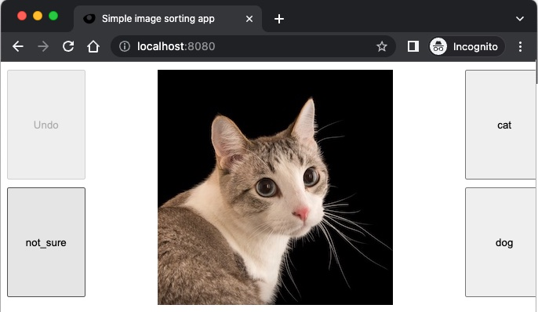

# Introduction

I wrote this tiny image sorting application, because I couldn't get the existing ones to work. I found couple of applications written in python + tkinter, and it's a pain to put that into Docker. Instead, I decided to write this in Go as a web app, so it can be easily run, deployed, and shared.

The advantage of this application is the ability to share it with external people (such as Upwork contractors), and run it on any device (phone, tablet, laptop, desktop, etc.) to do simple image sorting.

# Usage

The application expects four inputs:
- Input folder: where the images are stored
- Output folder: where the images will be moved to
- Left buckets: list of buckets (folders) that will display on the left side of UI
- Right buckets: list of buckets (folders) that will display on the right side of UI

You must provide at least two buckets total (for binary classification). The application will create the folders if they don't exist.

# Demo

To get started, try the demo by running `./demo.sh`. You will need Docker. Demo script will start a web server on port 8080, so you can access it by going to `http://localhost:8080`. You will be able to sort two images (a cat and a dog), into three folders: not_sure, cat and dog. The images are stored in `./demo` folder.

# Author

This application was written by [Mikolaj Stawiski](https://github.com/stawiski)
